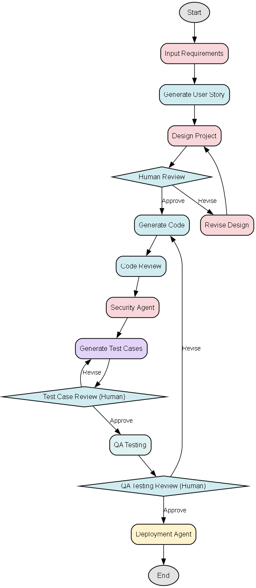

# ThinkDeploy: AI Software Architect that Builds it All

ThinkDeploy is an AI-powered SDLC automation engine that acts like your personal software architect. It takes raw project requirements and transforms them into complete, production-ready software artifacts — all through a visually guided workflow powered by LLMs and human feedback.



---

## 🔍 What is ThinkDeploy?

ThinkDeploy is a full-stack automation system for the Software Development Life Cycle (SDLC). It simulates how a senior engineering team would:

* Interpret requirements
* Design scalable architecture
* Write modular code
* Generate test cases
* Run QA checks
* Review and iterate with human feedback
* Prepare deployment artifacts

All done through an AI-first, human-approved pipeline.

---

## ✨ Key Features

* **LLM-Driven SDLC Pipeline**: User stories → Design → Code → Test → Deploy
* **Human-in-the-Loop Reviews**: Add feedback and regenerate at critical stages
* **Dynamic Routing**: QA/test failures route back to earlier nodes
* **One-Click PDF Report**: Export all deliverables as a single PDF
* **Clean, Modular UI**: Built with Streamlit and LangGraph

---

## 🧠 Architecture Overview

| Component       | Technology                     |
| --------------- | ------------------------------ |
| UI              | Streamlit                      |
| Workflow Engine | LangGraph + LangChain          |
| Language Model  | Groq API (Mixtral, Gemma etc.) |
| PDF Reports     | FPDF                           |
| State Handling  | Pydantic (SDLCState)           |


## 🛠 Project Structure

```
.
├── app.py               # Streamlit frontend
├── main.py              # CLI or backend control
├── graph.py             # SDLC graph via LangGraph
├── nodes.py             # Modular SDLC node logic
├── prompts.py           # Effective LLM prompts
├── state.py             # Global state tracking (Pydantic)
├── llm.py               # Groq API setup
├── utils.py             # PDF and helper utilities
├── requirements.txt     # Dependencies
├── .env                 # Secrets/API keys
└── thinkdeploy_sdlc_graph.png  # Visual workflow
```

---

## ⚙️ Get Started

1. **Install requirements**

```bash
pip install -r requirements.txt
```

2. **Create your `.env` file**

```env
GROQ_API_KEY=your_key_here
```

3. **Run the app**

```bash
streamlit run app.py
```

---

## 🧾 Generate Reports

At the end of the SDLC pipeline, click **Generate PDF Report** to compile all key deliverables:

* Requirements
* User stories
* Design documentation
* Source code
* Test cases and results
* QA and deployment log

---

## 🤝 Contributing

We welcome ideas, feedback, and pull requests.

* [x] Fork the repo
* [x] Create a feature branch
* [x] Submit a PR with a clear description

---

## 📢 License

MIT License. Use it, remix it, deploy it.

---

**ThinkDeploy is built for engineers who want to move fast, stay structured, and keep humans in the loop.**
